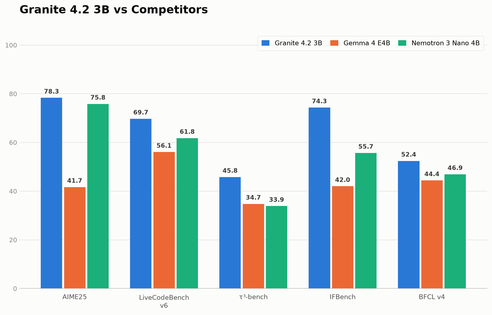
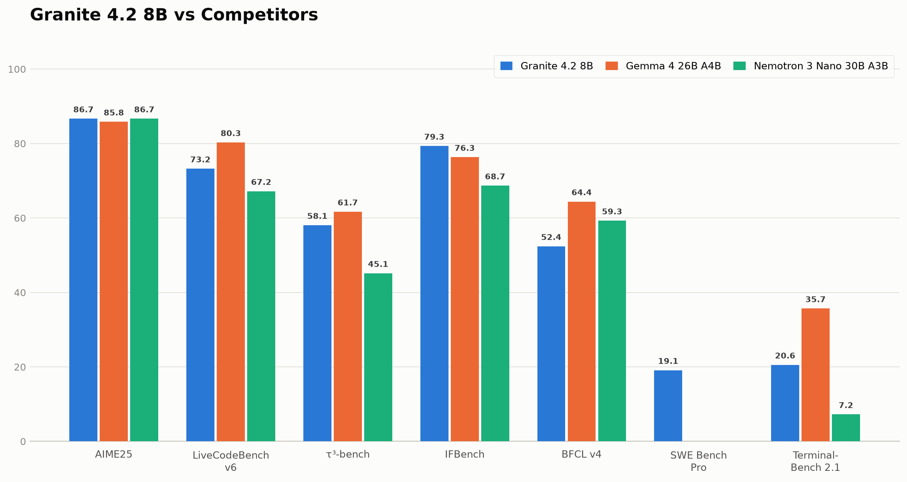
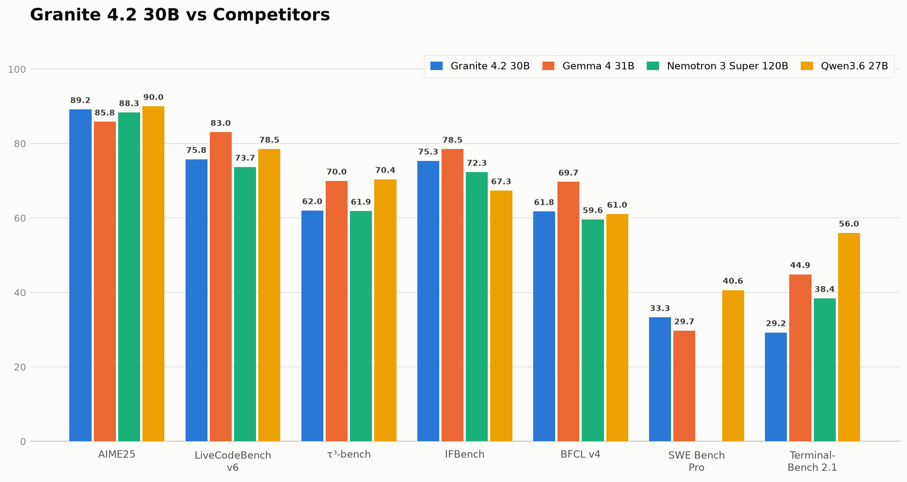

<p align="center">
  
</p>

<p align="center">
  :hugs: <a href="https://huggingface.co/collections/ibm-granite/granite-42-language-models">HuggingFace Collection</a>&nbsp | :hugs: <a href="https://huggingface.co/blog/ibm-granite/granite-4-2">HuggingFace Technical Blog</a> | :speech_balloon: <a href="https://github.com/orgs/ibm-granite/discussions">Discussions Page</a>&nbsp 
  
<!-- | 📘 <a href="https://www.ibm.com/granite/docs/">IBM Granite Docs </a> -->
<br>

---
## Overview
Granite is a family of open-source large language models developed by IBM, designed for enterprise and research use. Granite models are built to be versatile, safe, and efficient — covering a range of sizes and capabilities from compact edge-deployable models to large-scale reasoning systems.

The Granite 4.2 generation introduces native reasoning (thinking) capabilities, allowing models to perform step-by-step chain-of-thought reasoning before producing final answers. This significantly improves performance on complex math, coding, multi-step logic, and agentic tool-calling tasks. The Granite 4.2 familiy features dense decoder-only architectures in three sizes — 3B, 8B, and 30B, with quantized variants per model size. 

The Granite 4.2 dense models are post-trained on top of Granite 4.1 base models. Please refer to the [Granite 4.1 blog](https://huggingface.co/blog/ibm-granite/granite-4-1) for details on the pre-training phase. We provide instruct models checkpoints fine-tuned for dialogue, instruction following, helpfulness, safety, and reasoning, as well as quantized variants for each model size.

All models are publicly released under the Apache 2.0 license, allowing free use for both research and commercial purposes. The data curation and training processes were specifically designed for enterprise scenarios and customization, incorporating governance, risk, and compliance (GRC) evaluations alongside IBM's standard data clearance and document quality review procedures.


## How to Use our Models?
To use any of our models, pick an appropriate `model_path` from:
1. `ibm-granite/granite-4.2-3b`
2. `ibm-granite/granite-4.2-8b`
3. `ibm-granite/granite-4.2-30b`

## Quick Start Inference Examples with Transformers

### Installation

```bash
pip install torch torchvision torchaudio
pip install accelerate transformers
```

### Inference (Thinking Mode)

```python
import torch
from transformers import AutoModelForCausalLM, AutoTokenizer

model_path = "ibm-granite/granite-4.2-30b"
tokenizer = AutoTokenizer.from_pretrained(model_path)
model = AutoModelForCausalLM.from_pretrained(model_path, device_map="cuda", torch_dtype=torch.bfloat16)
model.eval()

messages = [
    {"role": "user", "content": "How many r's are in the word 'strawberry'?"},
]

text = tokenizer.apply_chat_template(messages, tokenize=False, add_generation_prompt=True, enable_thinking=True)
inputs = tokenizer(text, return_tensors="pt").to(model.device)

with torch.no_grad():
    output = model.generate(**inputs, max_new_tokens=8192, temperature=1.0, top_p=0.95, do_sample=True)

print(tokenizer.decode(output[0][inputs.input_ids.shape[-1]:], skip_special_tokens=False))
```

<details>
<summary><b>Example Output</b></summary>

```
<think>
Okay, let's see. The problem is to find how many 'r's are in the word 'strawberry'.

First, I need to write out the word: s t r a w b e r r y.

Now, I need to count the number of 'r' letters. Let's list each letter and check for 'r'.

1. s – not r
2. t – not r
3. r – yes, that's one
4. a – no
5. w – no
6. b – no
7. e – no
8. r – yes, that's two
9. r – yes, that's three
10. y – no

Total r's = 3.
</think>
There are **3** r's in the word "strawberry".<|im_end|>
```

</details>

### Inference (Non-Thinking Mode)

```python
messages = [
    {"role": "user", "content": "What is the capital of France?"},
]
text = tokenizer.apply_chat_template(messages, tokenize=False, add_generation_prompt=True, enable_thinking=False)
inputs = tokenizer(text, return_tensors="pt").to(model.device)

output = model.generate(**inputs, max_new_tokens=2048, temperature=1.0, top_p=0.95, do_sample=True)
print(tokenizer.decode(output[0][inputs.input_ids.shape[-1]:], skip_special_tokens=False))
```

<details>
<summary><b>Example Output</b></summary>

```
<think></think>The capital of France is Paris.<|im_end|>
```

</details>

### Low-Effort Thinking

```python
messages = [
    {"role": "user", "content": "What is 2 + 2?"},
]
text = tokenizer.apply_chat_template(messages, tokenize=False, add_generation_prompt=True,
                                     enable_thinking=True, low_effort=True)
inputs = tokenizer(text, return_tensors="pt").to(model.device)

output = model.generate(**inputs, max_new_tokens=4096, temperature=1.0, top_p=0.95, do_sample=True)
print(tokenizer.decode(output[0][inputs.input_ids.shape[-1]:], skip_special_tokens=False))
```

<details>
<summary><b>Example Output</b></summary>

```
<think>
Simple answer.
</think>
2 + 2 = 4.<|im_end|>
```

</details>

---

### Tool Calling with Integrated Reasoning

Granite-4.2 support tool calling with integrated reasoning — the model thinks about which tool to call and why before making the call. Tools are defined using the [OpenAI function definition schema](https://platform.openai.com/docs/guides/function-calling).

```python
tools = [
    {
        "type": "function",
        "function": {
            "name": "get_current_weather",
            "description": "Get the current weather for a specified city.",
            "parameters": {
                "type": "object",
                "properties": {
                    "city": {"type": "string", "description": "Name of the city"}
                },
                "required": ["city"]
            }
        }
    }
]

messages = [
    {"role": "user", "content": "What's the weather like in Boston right now?"},
]
text = tokenizer.apply_chat_template(messages, tokenize=False, tools=tools, add_generation_prompt=True, enable_thinking=True)
inputs = tokenizer(text, return_tensors="pt").to(model.device)

output = model.generate(**inputs, max_new_tokens=4096, temperature=1.0, top_p=0.95, do_sample=True)
print(tokenizer.decode(output[0][inputs.input_ids.shape[-1]:], skip_special_tokens=False))
```

<details>
<summary><b>Example Output</b></summary>

```
<think>
Okay, the user is asking for the weather in Boston right now. Let me check the tools
available. There's a function called get_current_weather that takes a city parameter.
I need to call that with the city set to Boston.
</think>
<tool_call>
<function=get_current_weather>
<parameter=city>
Boston
</parameter>
</function>
</tool_call>
<|im_end|>
```
</details>

### Multi-Turn with Tool Response

```python
messages = [
    {"role": "user", "content": "What's the weather like in Boston right now?"},
    {"role": "assistant", "content": "<think>\nThe user wants to know the current weather in Boston. I should call get_current_weather.\n</think>",
     "tool_calls": [{"function": {"name": "get_current_weather", "arguments": {"city": "Boston"}}}]},
    {"role": "tool", "content": '{"temperature": "72°F", "condition": "Partly cloudy", "humidity": "65%"}'},
]
text = tokenizer.apply_chat_template(messages, tokenize=False, tools=tools,
                                     add_generation_prompt=True, enable_thinking=True)
inputs = tokenizer(text, return_tensors="pt").to(model.device)

output = model.generate(**inputs, max_new_tokens=4096, temperature=1.0, top_p=0.95, do_sample=True)
print(tokenizer.decode(output[0][inputs.input_ids.shape[-1]:], skip_special_tokens=False))
```

<details>
<summary><b>Example Output</b></summary>

```
<think>
The tool returned the weather data for Boston: temperature 72°F, partly cloudy, humidity 65%.
I need to present this information clearly to the user.
</think>
The current weather in Boston is 72°F, partly cloudy, with 65% humidity.<|im_end|>
```

</details>

---

## Results and Comparisons

Granite 4.2 models were evaluated against similarly-sized competitors across reasoning (AIME25), coding (LiveCodeBench v6), instruction following (IFBench, τ³-bench), tool-calling (BFCL v4), and agentic benchmarks (SWE Bench Pro, Terminal-Bench 2.1). At the 3B scale, Granite leads decisively across all tasks. At 8B, Granite matches or exceeds competitors on reasoning and instruction following while being the only model reporting SWE Bench Pro results. At 30B, Granite achieves the highest score on SWE Bench Pro and remains competitive across all benchmarks against models of similar or larger size.

### 3B

<p align="center">
  
</p>

### 8B

<p align="center">
  
</p>

### 30B

<p align="center">
  
</p>

---

## How to Download our Models?
The model of choice (`ibm-granite/granite-4.2-8b` in this example) can be cloned using:
```shell
git clone https://https://huggingface.co/ibm-granite/granite-4.2-8b
```

## How to Contribute to this Project?
Plese check our [Guidelines](/CONTRIBUTING.md) and [Code of Conduct](/CODE_OF_CONDUCT.md) to contribute to our project.

## Model Cards
The model cards for each model variant are available in their respective HuggingFace repository. Please visit our collection [here](https://huggingface.co/collections/ibm-granite/granite-42-language-models).

## License 
All Granite 4.2 Language Models are distributed under [Apache 2.0](./LICENSE) license.

## Disclosures
Please find disclosures information [here](https://github.com/ibm-granite/granite-4.2-language-models/tree/main/disclosures).


## Would you like to provide feedback?
Please let us know your comments about our family of language models by visiting our [collection](https://huggingface.co/collections/ibm-granite/granite-42-language-models). Select the repository of the model you would like to provide feedback about. Then, go to *Community* tab, and click on *New discussion*. Alternatively, you can also post any questions/comments on our [github discussions page](https://github.com/orgs/ibm-granite/discussions).

## Citation
If you find granite models useful, please cite our work as follows:

```
@misc{granite2026,
  author       = {{IBM Research}},
  title        = {Granite 4.2 Language Models},
  year         = {2026},
  howpublished = {\url{https://huggingface.co/blog/ibm-granite/granite-4-2}},
  note         = {Accessed: 2026-07-25}
}
```


